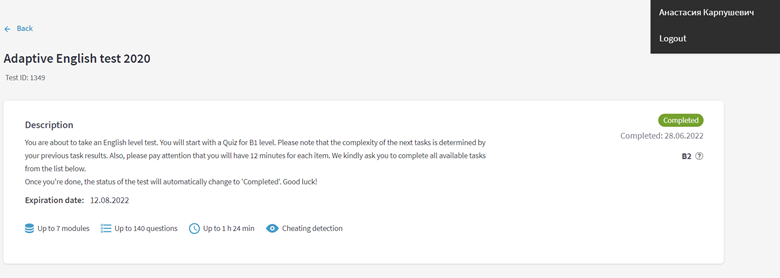

# Anastasiya Karpushevich
## Contacts:

**Phone:** +375445394631

**E-mail:** a.karpushevich.a@gmail.com

**Github:** NastyaKrp

**Telegram:** @nastya_krp

**Discord:** nastya.krpush (@NastyaKrp)

**[LinkedIn](https://www.linkedin.com/in/anastasia-karpushevich-5740b7244/)**

## About Me:

I’m a second-year student of BSU, faculty of applied math and computer science.

I have a great desire to upgrade my skills constantly, especially when it brings pleasure at the same time. 
Now I’m interested in getting more experience and knowledge in java. 

I’m a disciplined, ambitious and open-minded person.

## Skills:

* Java
* C++
* JavaScript
* Git, GitHub

## Experience:
[Projects](https://github.com/NastyaKrp/bsu-famcs/tree/main/2%20course/java) 

## Education:
* Java Basics course EPAM (completed)
* Java industrial programming course at university
* Git course EPAM (completed)

## Languages:

* English – B2 (result of EPAM test)

* Russian – Native

* Belarusian – B1

* Italian - A1

